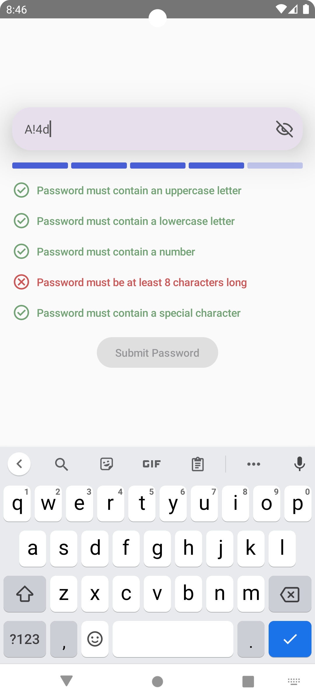

# PasswordFormComposable

  

## Medium Article

This project is accompanied by a detailed Medium article titled "Android Compose Tutorial - Password Form." You can read the article [here]().

## Overview

`PasswordFormComposable` is an Android UI built using Jetpack Compose. This project showcases the development of a `PasswordForm()` composable.

Key features of the `PasswordForm()` include:

- Dynamic Validation Logic: Utilizes a PasswordRule model to implement a customizable set of password validation rules, such as requiring uppercase letters, numbers, and special characters.
- Real-Time User Feedback: Offers immediate feedback on password strength and compliance with validation rules, enhancing the user experience.
- Customizable Password Strength Indicator: Features a `PasswordStrengthIndicator()` composable that visually represents the password's strength level with customizable colored bars.
- Responsive Password Input Field: Includes a `PasswordInputField()` composable with an integrated show/hide password toggle, providing a user-friendly way to enter and view passwords.
- Clear Validation Feedback UI: Implements a `ValidationFeedbackItemUi()` composable that displays an icon and message next to each password rule, changing in response to user input.
- Flexible and Reusable Design: Designed with flexibility in mind, allowing easy integration and customization in various Android projects.
- Accessible State Parameters: Exposes crucial state parameters like `passwordValue` and `isPasswordValid` for easy integration with broader app functionalities.

## Getting Started

1. Clone the repository to your local machine.
2. Open the project in Android Studio (preferably the latest version for full Compose support).
3. Run the app on an emulator or physical device to see the app in action.